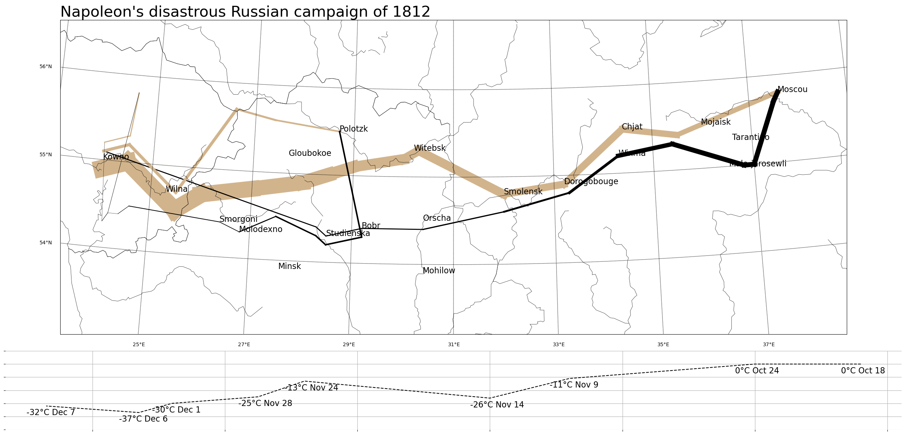

# 練習專案二 : 拿破崙征俄戰爭

## 簡介
本專題復刻了 Charles Minard 經典的資料視覺化作品
[Napoleon's disastrous Russian campaign of 1812](https://www.datavis.ca/gallery/re-minard.php)，
在同一張圖中呈現地理位置、軍隊人數、進攻/撤退方向與氣溫變化，
是資料視覺化史上公認結合最多維度、卻依然清晰易懂的經典範例。

這個原始資料是非標準格式的固定寬度文字檔，因此練習了手動解析文字檔、
依欄位性質拆分資料表，並使用 `pandas` 與 `sqlite3` 建立資料庫，
搭配 `matplotlib` 與 `basemap` 疊加多層地圖圖層，重現這幅歷史名作的視覺效果。


## 如何重現
- 安裝 `Miniconda`
- 依據 `environment.yml` 建立環境：
```bash
  conda env create -f environment.yml
```
- 將 `data/` 資料夾中的 `minard.txt` 置放於工作目錄中的 `data/` 資料夾
- 啟動環境並執行 `python create_minard_db.py`，會在 `data/` 資料夾中建立 `minard.db`
- 啟動環境並執行 `python plot_with_basemap.py`，會生成 `minard_clone.png`


## 檔案結構
```
02-minard_clone/
├── data/ # 原始文字檔與 minard.db
├── create_minard_db.py # 解析文字檔並建立資料庫
├── proof_of_concept.py # matplotlib 概念驗證（四張圖分開繪製）
├── plot_with_basemap.py # 合併四圖，產出最終成品
└── minard_clone.png # 最終成品
```

## 快速連結

- [成品圖片](./minard_clone.png)