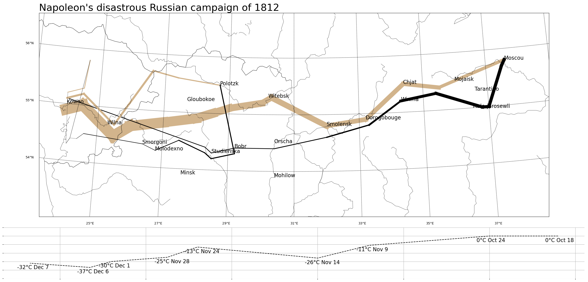

# 練習專案二 : 拿破崙征俄戰爭

## 簡介
本專題復刻了 Charles Minard 經典的資料視覺化作品
[Napoleon's disastrous Russian campaign of 1812](https://www.datavis.ca/gallery/re-minard.php)，
在同一張圖中呈現地理位置、軍隊人數、進攻/撤退方向與氣溫變化，
是資料視覺化史上公認結合最多維度、卻依然清晰易懂的經典範例。

這個原始資料是非標準格式的固定寬度文字檔，因此練習了手動解析文字檔、
依欄位性質拆分資料表，並使用 `pandas` 與 `sqlite3` 建立資料庫，
搭配 `matplotlib` 與 `basemap` 疊加多層地圖圖層，重現這幅歷史名作的視覺效果。

## 資料來源

採用 [The Grammar of Graphics](https://www.cs.uic.edu/~wilkinson/TheGrammarOfGraphics/GOG.html)
網站提供的[文字檔](https://www.datavis.ca/gallery/minard/minard.txt)。

## 流程

1. **建立資料庫**：手動解析固定寬度文字檔，依欄位性質拆分成城市、氣溫、軍隊三張資料表，存入 SQLite
2. **概念驗證**：分別用 matplotlib 繪製地圖、城市、氣溫、軍隊四張圖，確認各圖層邏輯正確
3. **產出成品**：用 matplotlib 與 basemap 疊加四個圖層，重現完整的複合式視覺化

## 如何重現

原始文字檔 `minard.txt` 需事先置於 `data/` 資料夾。

```bash
conda env create -f environment.yml
python create_minard_db.py       # 建立 minard.db
python plot_with_basemap.py      # 產出 minard_clone.png
```

## 檔案結構
```
02-minard_clone/
├── data/                 # 原始文字檔與 minard.db
├── create_minard_db.py   # 解析文字檔並建立資料庫
├── proof_of_concept.py   # matplotlib 概念驗證（四張圖分開繪製）
├── plot_with_basemap.py  # 合併四圖，產出最終成品
└── minard_clone.png      # 最終成品
```

## 快速連結

- [成品圖片-行軍地圖](./minard_clone.png)


## 資料需求對照

| 視覺元素 | 對應資料 |
|---|---|
| X 軸 | 經度 |
| Y 軸 | 緯度 |
| 顏色 | 進攻/撤退 |
| 粗細 | 軍隊人數 |
| 時間軸 | 資料日期 |
| 粗細 | 氣溫 |