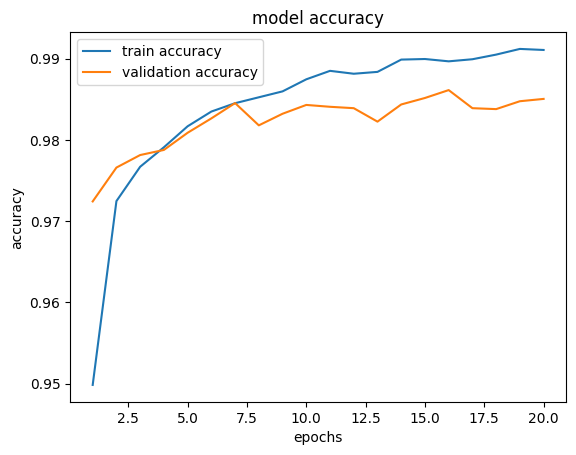
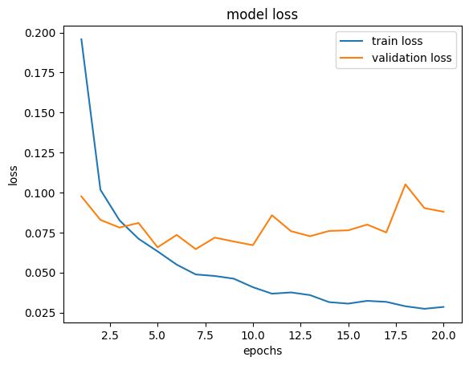

# ECG 心律不整辨識｜Arrhythmia Detection

## 專題說明
使用 1D-CNN 對 ECG (心電圖) 心跳時序訊號進行分類，辨識 5 種心律類型。

## 資料集
- 來源：[ECG Heartbeat Categorization Dataset](https://www.kaggle.com/datasets/yasserhessein/heartbeat)
- 原始資料：[MIT-BIH Arrhythmia Database](https://physionet.org/content/mitdb/1.0.0/)
- 資料來源：48 位病人，每人約 30 分鐘的 ECG 時序訊號記錄。

| 資料集 | 筆數 |
|--------|------|
| 訓練集 | 87,553 |
| 測試集 | 21,891 |

### 5 種心律分類

| 類別 | 英文 | 中文 |
|------|------|------|
| 0 | Normal beat (N) | 正常心跳 |
| 1 | Supraventricular premature beat (S) | 心室上早期收縮 |
| 2 | Premature ventricular contraction (V) | 心室早期收縮 |
| 3 | Fusion of ventricular and normal beat (F) | 心室融合波 |
| 4 | Unclassifiable beat (Q) | 無法分類 |

## 分析流程

1. 資料標準化（StandardScaler）
2. 標籤處理（NaN 過濾、one-hot 編碼）
3. 新增通道維度，符合 1D-CNN 輸入格式
4. 切出 20% 驗證集

## 模型架構

| 層級 | 類型 | 說明 |
|------|------|------|
| 第1層 | Conv1D(32) + MaxPooling | 找出基本 ECG 波形特徵 |
| 第2層 | Conv1D(64) + MaxPooling | 學習更複雜的特徵 |
| 第3層 | BatchNormalization | 正規化加速訓練 |
| 第4層 | Flatten + Dense(128) | 整合特徵 |
| 第5層 | Dropout(0.5) | 防止過擬合 |
| 輸出層 | Dense(5) + Softmax | 輸出 5 種心律機率 |

- 優化器：Adam
- 損失函數：Categorical Crossentropy
- 訓練輪數：20 輪

## 評估結果

**測試集準確率：98.47%**

| 類別 | 心律類型 | Precision | Recall | F1 | 樣本數 |
|------|---------|-----------|--------|-----|--------|
| 0 | Normal | 99% | 100% | 99% | 18,117 |
| 1 | Supraventricular | 90% | 78% | 83% | 556 |
| 2 | Ventricular | 96% | 96% | 96% | 1,448 |
| 3 | Fusion | 90% | 73% | 81% | 162 |
| 4 | Unclassifiable | 99% | 98% | 99% | 1,608 |

| 準確率曲線 | 損失值曲線 |
|-----------|-----------|
|  |  |

## 臨床觀點
Recall（召回率）比 Precision 更重要：
漏診（False Negative）可能延誤治療，危及生命。

類別 1（心室上早期收縮）Recall 78%、類別 3（心室融合波）Recall 73%，
兩者因樣本數少，仍有改善空間。模型結果需搭配臨床判斷。

## 參考來源
- [ECG Heartbeat Categorization Dataset - Kaggle](https://www.kaggle.com/datasets/yasserhessein/heartbeat)
- [Kachuee et al. (2018) - ECG Heartbeat Classification](https://arxiv.org/abs/1805.00794)
- [Arrhythmia-ECG-Detection - laksh2005](https://github.com/laksh2005/Arrhythmia-ECG-Detection)