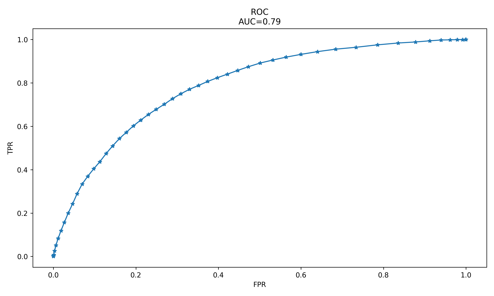
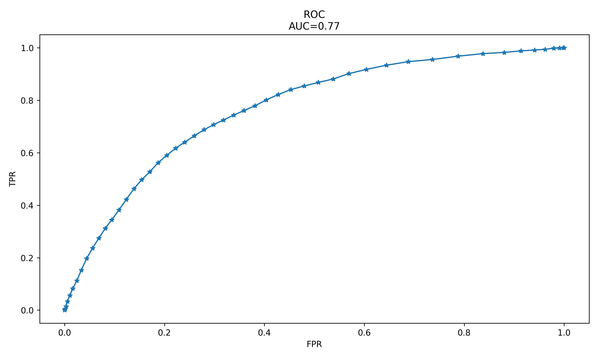

# 敗血症預測｜Sepsis Prediction

## 專題說明
使用 PhysioNet Computing in Cardiology Challenge 2019 的 ICU 臨床資料，
建立雙輸入 LSTM 模型，輸入 10 小時資料預測下一小時發生敗血症的機率。

## 資料集
- 來源：[PhysioNet Challenge 2019](https://physionet.org/content/challenge-2019/1.0.0/)
- 格式：PSV 檔案，每列代表一小時的臨床資料
- 總病人數：40,000 人，測試集：6,000 人

> 資料檔案過大，不包含在此 repository，請至官網下載。

## 執行順序

| Notebook | 說明 |
|----------|------|
| `1-psv_to_df.ipynb` | 讀取 PSV 檔案合併成 DataFrame（選用）|
| `2-feature_engineering.ipynb` | 產生 10 小時滑動視窗特徵 |
| `3-feature_selection.ipynb` | 檢查特徵相關性，移除冗餘特徵 |
| `4-train_model.ipynb` | 訓練 LSTM 模型並評估結果 |

## 分析流程

### 1. 重新定義標籤
原始資料在敗血症發生前 6 小時開始標記，本專題改為發生當下才標記，
以符合「提早 1 小時預測」的目標。

### 2. 滑動視窗
每位病人的資料切割為 10 小時視窗，預測第 11 小時是否發生敗血症，
視窗每次滑動 1 小時。

### 3. 缺失值處理

| 類型 | 欄位 | 處理方式 |
|------|------|---------|
| 缺失 < 15% | HR, MAP, O2Sat, SBP, Resp | bfill/ffill 補值 |
| 缺失 > 15% | 其餘 33 個欄位 | 取視窗中位數 |

### 4. 特徵標準化
用訓練集的 mean 和 std 標準化所有特徵，測試集套用相同參數，避免資料洩漏。

### 5. 特徵相關性分析
以熱力圖檢查特徵間相關性，結果顯示無高度相關特徵，保留全部特徵。

## 模型架構
- 模型1：雙向 LSTM（處理連續時序特徵）
- 模型2：Dense 層（處理稀疏類別特徵，NaN 以 π 遮蔽）
- 合併方式：Add()

## 評估結果

因為資料集嚴重不平衡（敗血症 : 正常 ≈ 1 : 53），
AUC 同時考慮 TPR 與 FPR，能更客觀反映模型表現。

| 資料集 | AUC | ROC 曲線 |
|--------|-----|---------|
| 驗證集 | 0.79 |  |
| 測試集 | 0.77 |  |

## 臨床觀點
身為呼吸治療師，敗血症的早期預測對 ICU 病人至關重要。
FN（漏診）可能導致延誤治療，AUC 比準確率更適合評估此類不平衡資料集。

## 參考來源
- [nerajbobra/sepsis-prediction](https://github.com/nerajbobra/sepsis-prediction)（MIT License）