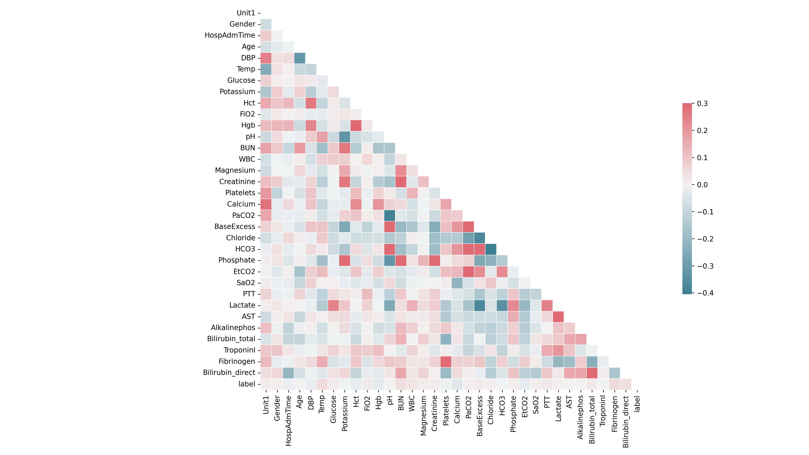

# 敗血症預測｜Sepsis Prediction

## 專題說明
建立雙向 LSTM 模型，輸入 10 小時資料預測下一小時發生敗血症的機率。

## 資料集
- 來源：[PhysioNet Challenge 2019](https://physionet.org/content/challenge-2019/1.0.0/)
- 格式：PSV 檔案，每列代表一小時的臨床資料
- 總病人數：40,000 人，測試集：6,000 人

> 資料檔案過大，不包含在此 repository，請至官網下載。

## 執行順序

| Notebook | 說明 |
|----------|------|
| `1-psv_to_df.ipynb` | 讀取 PSV 檔案合併成 DataFrame（選用）|
| `2-feature_engineering.ipynb` | 產生 10 小時滑動視窗特徵 |
| `3-feature_selection.ipynb` | 檢查特徵相關性，移除冗餘特徵 |
| `4-train_model.ipynb` | 訓練 LSTM 模型並評估結果 |

## 分析流程
1. 重新定義標籤：原始標籤提前 6 小時標記，改為發生當下才標記
2. 切割 10 小時滑動視窗，預測第 11 小時是否發生敗血症
3. 缺失 < 15% 的欄位用 bfill/ffill 補值，其餘取中位數
4. 用訓練集 mean/std 標準化，避免資料洩漏
5. 以熱力圖確認無高度相關特徵，保留全部特徵

## 模型架構
- 模型1：雙向 LSTM（處理 HR, MAP, O2Sat, SBP, Resp 的時序資料）
- 模型2：Dense 層（處理 33 個稀疏特徵，NaN 以 π 遮蔽）
- 合併方式：Add()
- 優化器：Adam｜損失函數：Categorical Crossentropy

## 評估結果

資料集不平衡（敗血症 : 正常 ≈ 1 : 53），使用 AUC 作為主要評估指標。

| 驗證集 ROC | 測試集 ROC |
| :---: | :---: |
| AUC = 0.79 | AUC = 0.77 |
|  |  |

## 臨床觀點

假陰性（False Negative，敗血症被預測為正常）
比假陽性更危險，可能延誤治療危及生命。 
但模型結果仍需搭配臨床判斷，不可單獨作為診斷依據。

## 參考來源
- [nerajbobra/sepsis-prediction](https://github.com/nerajbobra/sepsis-prediction)（MIT License）